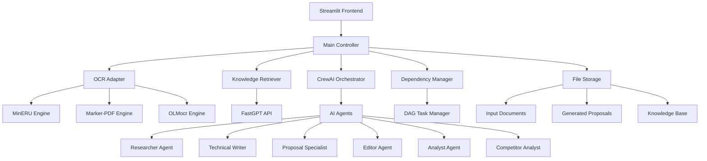
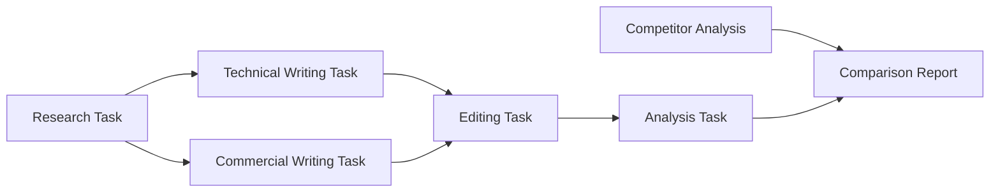

# Design Document

## Overview

The AI Bid Assistant is a sophisticated document generation system that leverages multiple AI technologies to automate the creation of professional bid proposals. The system uses a multi-agent architecture powered by CrewAI, knowledge retrieval through FastGPT RAG, configurable OCR engines for document parsing, and a user-friendly Streamlit interface.

The core design philosophy centers around modularity, scalability, and privacy. Each component is designed to be independently configurable and replaceable, supporting both cloud and private deployment scenarios.

## Architecture

### High-Level Architecture



### System Layers

1. **Presentation Layer**: Streamlit web interface for user interactions
2. **Orchestration Layer**: Main controller managing workflow and agent coordination
3. **Processing Layer**: OCR engines, RAG retrieval, and AI agents
4. **Data Layer**: File storage for documents, knowledge base, and outputs

## Components and Interfaces

### 1. OCR Adapter (`tools/ocr_adapter.py`)

**Purpose**: Unified interface for multiple OCR engines with configurable switching

**Interface**:
```python
class OCRAdapter:
    def __init__(self, engine_type: str = "marker-pdf")
    def parse_document(self, file_path: str) -> DocumentStructure
    def extract_table_of_contents(self, file_path: str) -> List[Section]
    def get_available_engines(self) -> List[str]
```

**Key Features**:
- Plugin architecture for easy engine addition
- Consistent output format regardless of underlying engine
- Error handling and fallback mechanisms
- Performance monitoring and logging

### 2. Knowledge Retriever (`tools/knowledge_retriever.py`)

**Purpose**: Interface to FastGPT RAG system for historical document retrieval

**Interface**:
```python
class KnowledgeRetriever:
    def __init__(self, api_key: str, base_url: str, kb_id: str)
    def search_similar_content(self, query: str, top_k: int = 5) -> List[Document]
    def get_relevant_cases(self, requirements: List[str]) -> List[Case]
    def retrieve_product_docs(self, product_names: List[str]) -> List[Document]
```

**Key Features**:
- Semantic search capabilities
- Context-aware retrieval based on tender requirements
- Caching for improved performance
- Support for multiple knowledge bases

### 3. PDF Splitter (`tools/pdf_splitter.py`)

**Purpose**: Intelligent document chunking based on structure and content

**Interface**:
```python
class PDFSplitter:
    def split_by_toc(self, document: DocumentStructure) -> List[Section]
    def create_section_summaries(self, sections: List[Section]) -> List[Summary]
    def extract_requirements(self, sections: List[Section]) -> List[Requirement]
    def identify_dependencies(self, sections: List[Section]) -> DependencyGraph
```

**Key Features**:
- Table of contents-based splitting
- Intelligent section boundary detection
- Requirement extraction and categorization
- Dependency relationship identification

### 4. CrewAI Orchestrator (`main.py`, `agents.py`, `tasks.py`)

**Purpose**: Multi-agent coordination for specialized content generation

**Agent Definitions**:

- **Researcher Agent**: Analyzes tender documents and extracts structured requirements
- **Technical Writer Agent**: Creates technical solution sections with product integration
- **Proposal Specialist Agent**: Handles commercial aspects, pricing, and service commitments
- **Editor Agent**: Ensures compliance, consistency, and professional quality
- **Analyst Agent**: Scores proposals across multiple dimensions
- **Competitor Analyst Agent**: Analyzes competitor documents for comparison

**Task Flow**:


### 5. Dependency Manager (`tools/dependency_manager.py`)

**Purpose**: DAG-based task scheduling ensuring logical section dependencies

**Interface**:
```python
class DependencyManager:
    def create_dependency_graph(self, sections: List[Section]) -> DAG
    def validate_dependencies(self, graph: DAG) -> ValidationResult
    def get_execution_order(self, graph: DAG) -> List[Task]
    def check_prerequisites(self, task: Task, completed: List[Task]) -> bool
```

**Key Features**:
- Circular dependency detection
- Optimal execution order calculation
- Dynamic dependency resolution
- Progress tracking and rollback capabilities

### 6. Document Generator (`tools/docx_utils.py`)

**Purpose**: Professional document assembly with formatting and structure

**Interface**:
```python
class DocumentGenerator:
    def merge_sections(self, sections: List[GeneratedSection]) -> Document
    def generate_table_of_contents(self, document: Document) -> TOC
    def apply_formatting(self, document: Document, template: Template) -> Document
    def add_page_numbers(self, document: Document) -> Document
```

**Key Features**:
- Template-based formatting
- Automatic table of contents generation
- Page numbering and cross-references
- Style consistency enforcement

### 7. Version Comparison (`tools/version_diff.py`)

**Purpose**: Document comparison and change visualization

**Interface**:
```python
class VersionDiff:
    def compare_documents(self, doc1: Document, doc2: Document) -> DiffResult
    def generate_html_diff(self, diff_result: DiffResult) -> str
    def highlight_changes(self, diff_result: DiffResult) -> HighlightedDocument
```

## Data Models

### Core Data Structures

```python
@dataclass
class DocumentStructure:
    title: str
    sections: List[Section]
    metadata: Dict[str, Any]
    requirements: List[Requirement]

@dataclass
class Section:
    id: str
    title: str
    content: str
    subsections: List['Section']
    dependencies: List[str]
    requirements: List[Requirement]

@dataclass
class Requirement:
    id: str
    text: str
    type: RequirementType  # MANDATORY, SCORING, OPTIONAL
    weight: float
    section_id: str

@dataclass
class GeneratedContent:
    section_id: str
    content: str
    agent_id: str
    confidence_score: float
    sources: List[str]

@dataclass
class ProposalScore:
    technical: float
    commercial: float
    service: float
    qualification: float
    overall: float
    details: Dict[str, Any]
```

### Configuration Models

```python
@dataclass
class SystemConfig:
    ocr_engine: str = "marker-pdf"
    fastgpt_config: FastGPTConfig
    agents_config: Dict[str, AgentConfig]
    output_format: str = "docx"
    enable_human_approval: bool = True

@dataclass
class FastGPTConfig:
    api_key: str
    base_url: str
    knowledge_base_id: str
    max_tokens: int = 4000
```

## Error Handling

### Error Categories and Strategies

1. **Document Processing Errors**:
   - OCR failures: Automatic fallback to alternative engines
   - Parsing errors: Graceful degradation with manual intervention options
   - Large document handling: Automatic chunking with progress tracking

2. **API Integration Errors**:
   - FastGPT API failures: Local caching and retry mechanisms
   - Rate limiting: Exponential backoff and queue management
   - Network issues: Offline mode with reduced functionality

3. **Agent Execution Errors**:
   - Agent failures: Task redistribution to backup agents
   - Content quality issues: Multi-stage validation and human review
   - Dependency resolution failures: Alternative execution paths

4. **User Interface Errors**:
   - File upload issues: Clear error messages and format validation
   - Progress tracking: Real-time status updates and error reporting
   - Session management: Auto-save and recovery mechanisms

### Error Recovery Mechanisms

```python
class ErrorHandler:
    def handle_ocr_failure(self, error: OCRError) -> RecoveryAction
    def handle_api_timeout(self, error: APIError) -> RecoveryAction
    def handle_agent_failure(self, error: AgentError) -> RecoveryAction
    def log_error(self, error: Exception, context: Dict[str, Any])
```

## Testing Strategy

### Unit Testing
- Individual component testing with mock dependencies
- OCR adapter testing with sample documents
- Agent behavior testing with controlled inputs
- Data model validation testing

### Integration Testing
- End-to-end workflow testing
- API integration testing with FastGPT
- Multi-agent collaboration testing
- Document generation pipeline testing

### Performance Testing
- Large document processing benchmarks
- Concurrent user load testing
- Memory usage optimization testing
- API response time monitoring

### Security Testing
- Input validation and sanitization
- File upload security testing
- API key management validation
- Data privacy compliance testing

### Test Data Management
```python
class TestDataManager:
    def create_sample_tender(self) -> Document
    def create_mock_knowledge_base(self) -> KnowledgeBase
    def generate_test_scenarios(self) -> List[TestScenario]
```

## Deployment Architecture

### Local Development
- Docker containerization for consistent environments
- Local FastGPT instance for development
- File-based storage for simplicity
- Hot-reload for rapid development

### Private Enterprise Deployment
- Kubernetes orchestration for scalability
- Private FastGPT deployment
- Secure file storage with encryption
- Load balancing for multiple users

### Configuration Management
```python
class DeploymentConfig:
    environment: str  # development, staging, production
    storage_backend: str  # local, s3, azure
    fastgpt_deployment: str  # cloud, private
    security_level: str  # basic, enterprise
```

## Security Considerations

### Data Privacy
- All document processing occurs within controlled environment
- No external data transmission without explicit configuration
- Encryption at rest and in transit
- Audit logging for compliance

### Access Control
- Role-based access control for different user types
- Document-level permissions
- API key management and rotation
- Session security and timeout management

### Compliance Features
- Data retention policies
- Export controls for sensitive documents
- Audit trail maintenance
- GDPR compliance support