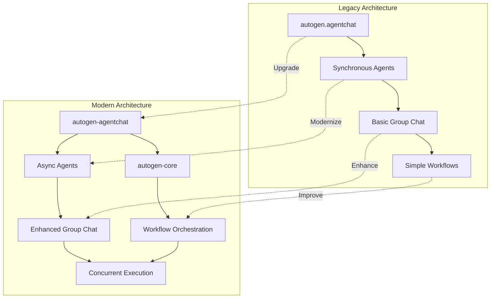
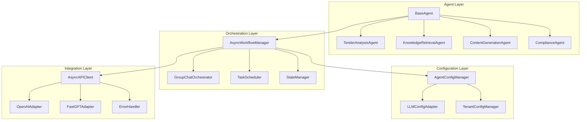
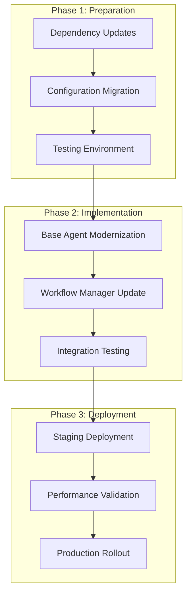

# Design Document

## Overview

The Autogen Modernization project upgrades the AI bid assistant system from the legacy Autogen framework to the latest version (v0.4+). The modernization focuses on adopting the new modular architecture with `autogen-agentchat` and `autogen-core` packages, implementing proper async/await patterns, and following current best practices for multi-agent systems.

The design maintains backward compatibility while introducing significant improvements in performance, reliability, and maintainability. The new architecture leverages Autogen's enhanced async capabilities, improved error handling, and modern agent orchestration patterns.

## Architecture

### High-Level Architecture Changes



### Component Architecture



## Components and Interfaces

### 1. Modernized Base Agent (`agents/base_agent.py`)

**Purpose**: Updated base class using latest Autogen patterns with async support

**Interface**:
```python
from autogen_agentchat import AssistantAgent, ConversableAgent
from autogen_core import Agent, MessageContext
from typing import Dict, Any, Optional, List
import asyncio

class ModernBaseAgent(ABC):
    def __init__(self, tenant_id: str, config: Dict[str, Any])
    async def initialize_agent(self) -> AssistantAgent
    async def execute_async(self, input_data: Dict[str, Any]) -> Dict[str, Any]
    async def generate_reply_async(self, messages: List[Dict[str, Any]]) -> str
    async def register_functions(self, functions: Dict[str, callable])
    def get_agent_config(self) -> Dict[str, Any]
```

**Key Features**:
- Async-first design with proper await patterns
- Modern Autogen agent initialization
- Enhanced error handling and retry mechanisms
- Structured logging with tenant context
- Performance metrics collection

### 2. Async Workflow Manager (`agents/async_workflow_manager.py`)

**Purpose**: Modern workflow orchestration using latest Autogen group chat patterns

**Interface**:
```python
from autogen_agentchat import GroupChat, GroupChatManager
from autogen_core import WorkflowOrchestrator

class AsyncWorkflowManager:
    def __init__(self, config: Dict[str, Any])
    async def create_workflow(self, workflow_id: str, agents: List[ModernBaseAgent]) -> str
    async def execute_workflow_async(self, workflow_id: str, initial_message: str) -> Dict[str, Any]
    async def get_workflow_status(self, workflow_id: str) -> Dict[str, Any]
    async def handle_human_feedback(self, workflow_id: str, feedback: Dict[str, Any])
    async def cancel_workflow(self, workflow_id: str)
```

**Key Features**:
- Full async workflow execution
- Enhanced group chat management
- Real-time status tracking
- Concurrent workflow support
- Improved error recovery

### 3. LLM Configuration Adapter (`config/llm_config_adapter.py`)

**Purpose**: Adapter for new Autogen LLM configuration format

**Interface**:
```python
from autogen_agentchat.models import OpenAIModel
from pydantic import BaseModel

class LLMConfigAdapter:
    def __init__(self, tenant_config: Dict[str, Any])
    def create_openai_config(self) -> OpenAIModel
    def create_agent_config(self, agent_type: str) -> Dict[str, Any]
    def validate_config(self, config: Dict[str, Any]) -> bool
    def migrate_legacy_config(self, legacy_config: Dict[str, Any]) -> Dict[str, Any]
```

**Key Features**:
- Modern LLM configuration patterns
- Automatic legacy config migration
- Validation and error checking
- Multi-provider support
- Tenant-specific customization

### 4. Enhanced Agent Classes

#### Modernized Tender Analysis Agent
```python
from autogen_agentchat import AssistantAgent
from autogen_core import FunctionTool

class ModernTenderAnalysisAgent(ModernBaseAgent):
    async def initialize_agent(self) -> AssistantAgent:
        # Modern agent initialization with new patterns
        
    async def analyze_document_async(self, document: str) -> Dict[str, Any]:
        # Async document analysis
        
    async def extract_requirements_async(self, document: str) -> Dict[str, Any]:
        # Async requirement extraction
```

#### Modernized Knowledge Retrieval Agent
```python
class ModernKnowledgeRetrievalAgent(ModernBaseAgent):
    async def initialize_agent(self) -> AssistantAgent:
        # Modern agent with RAG integration
        
    async def search_knowledge_async(self, query: str) -> Dict[str, Any]:
        # Async knowledge search
        
    async def retrieve_context_async(self, requirements: List[str]) -> Dict[str, Any]:
        # Async context retrieval
```

### 5. Group Chat Orchestrator (`orchestration/group_chat_orchestrator.py`)

**Purpose**: Modern group chat management with enhanced features

**Interface**:
```python
from autogen_agentchat import GroupChat, GroupChatManager

class GroupChatOrchestrator:
    def __init__(self, config: Dict[str, Any])
    async def create_group_chat(self, agents: List[AssistantAgent]) -> GroupChat
    async def execute_group_conversation(self, initial_message: str) -> List[Dict[str, Any]]
    async def handle_human_input(self, message: str) -> Dict[str, Any]
    def get_conversation_history(self) -> List[Dict[str, Any]]
```

**Key Features**:
- Enhanced speaker selection algorithms
- Improved conversation flow control
- Better human-in-the-loop integration
- Advanced message routing
- Conversation state management

## Data Models

### Modern Agent Configuration
```python
from pydantic import BaseModel, Field
from typing import Optional, List, Dict, Any
from enum import Enum

class AgentType(str, Enum):
    TENDER_ANALYST = "tender_analyst"
    KNOWLEDGE_RETRIEVER = "knowledge_retriever"
    CONTENT_GENERATOR = "content_generator"
    COMPLIANCE_VERIFIER = "compliance_verifier"

class ModernLLMConfig(BaseModel):
    model: str = Field(..., description="Model name")
    api_key: str = Field(..., description="API key")
    base_url: Optional[str] = Field(None, description="Custom base URL")
    temperature: float = Field(0.7, ge=0.0, le=2.0)
    max_tokens: Optional[int] = Field(None, gt=0)
    timeout: int = Field(60, gt=0)
    retry_attempts: int = Field(3, ge=1)

class ModernAgentConfig(BaseModel):
    agent_id: str
    agent_type: AgentType
    name: str
    system_message: str
    llm_config: ModernLLMConfig
    functions: Optional[List[str]] = None
    human_input_mode: str = "NEVER"
    max_consecutive_auto_reply: int = 10

class WorkflowConfig(BaseModel):
    workflow_id: str
    name: str
    description: str
    agents: List[ModernAgentConfig]
    max_rounds: int = 10
    speaker_selection_method: str = "auto"
    human_input_timeout: int = 300
    enable_logging: bool = True
```

### Async Execution Context
```python
class AsyncExecutionContext(BaseModel):
    workflow_id: str
    execution_id: str
    tenant_id: str
    start_time: datetime
    status: str
    current_step: str
    progress: float
    agents_status: Dict[str, str]
    conversation_history: List[Dict[str, Any]]
    error_log: Optional[List[str]] = None
    metrics: Optional[Dict[str, Any]] = None

class AsyncTaskResult(BaseModel):
    task_id: str
    agent_id: str
    status: str
    result: Optional[Dict[str, Any]] = None
    error: Optional[str] = None
    execution_time: float
    tokens_used: Optional[int] = None
```

### Migration Data Models
```python
class LegacyConfigMigration(BaseModel):
    source_config: Dict[str, Any]
    target_config: ModernAgentConfig
    migration_notes: List[str]
    compatibility_warnings: List[str]

class UpgradeReport(BaseModel):
    migration_id: str
    timestamp: datetime
    agents_migrated: int
    workflows_updated: int
    errors_encountered: List[str]
    performance_improvements: Dict[str, float]
```

## Error Handling

### Enhanced Error Management
```python
from enum import Enum
from typing import Optional, Dict, Any
import asyncio

class AutogenErrorType(str, Enum):
    AGENT_INITIALIZATION = "agent_initialization"
    LLM_API_ERROR = "llm_api_error"
    WORKFLOW_EXECUTION = "workflow_execution"
    CONFIGURATION_ERROR = "configuration_error"
    TIMEOUT_ERROR = "timeout_error"

class ModernErrorHandler:
    def __init__(self, config: Dict[str, Any]):
        self.retry_config = config.get("retry", {})
        self.timeout_config = config.get("timeout", {})
    
    async def handle_agent_error(self, error: Exception, context: Dict[str, Any]) -> Dict[str, Any]:
        """Handle agent-specific errors with modern patterns"""
        
    async def retry_with_backoff(self, func: callable, max_retries: int = 3) -> Any:
        """Implement exponential backoff retry logic"""
        
    async def handle_timeout(self, task: asyncio.Task, timeout: int) -> Any:
        """Handle async task timeouts gracefully"""
```

### Error Recovery Strategies
1. **Agent Failure Recovery**: Automatic agent restart with state preservation
2. **API Timeout Handling**: Intelligent retry with exponential backoff
3. **Workflow Interruption**: Graceful workflow pause and resume
4. **Configuration Errors**: Automatic fallback to default configurations
5. **Memory Management**: Automatic cleanup of failed agent instances

## Testing Strategy

### Unit Testing Framework
```python
import pytest
import asyncio
from unittest.mock import AsyncMock, MagicMock

class TestModernAgents:
    @pytest.fixture
    async def mock_agent(self):
        """Create mock modern agent for testing"""
        
    @pytest.mark.asyncio
    async def test_agent_initialization(self, mock_agent):
        """Test modern agent initialization patterns"""
        
    @pytest.mark.asyncio
    async def test_async_execution(self, mock_agent):
        """Test async agent execution"""
        
    @pytest.mark.asyncio
    async def test_error_handling(self, mock_agent):
        """Test error handling in async context"""
```

### Integration Testing
- End-to-end workflow testing with real Autogen agents
- Multi-agent collaboration testing
- Performance benchmarking against legacy implementation
- Concurrent execution testing
- Error recovery testing

### Migration Testing
- Legacy configuration migration validation
- Backward compatibility testing
- Performance comparison testing
- Data integrity verification
- Rollback procedure testing

## Deployment Architecture

### Modernization Deployment Strategy



### Configuration Management
```python
class ModernDeploymentConfig:
    def __init__(self, environment: str):
        self.environment = environment
        self.autogen_version = "0.4+"
        self.async_enabled = True
        self.performance_monitoring = True
    
    def get_agent_config(self) -> Dict[str, Any]:
        """Get environment-specific agent configuration"""
        
    def get_migration_config(self) -> Dict[str, Any]:
        """Get migration-specific configuration"""
```

## Security Considerations

### Enhanced Security Features
1. **Secure Agent Communication**: Encrypted message passing between agents
2. **API Key Management**: Secure storage and rotation of LLM API keys
3. **Input Validation**: Enhanced validation for agent inputs and configurations
4. **Audit Logging**: Comprehensive logging of all agent activities
5. **Access Control**: Role-based access control for agent management

### Privacy Enhancements
- Local agent execution options
- Data encryption at rest and in transit
- Tenant data isolation improvements
- Compliance with data protection regulations
- Secure configuration management

## Performance Optimizations

### Async Performance Improvements
1. **Concurrent Agent Execution**: Multiple agents running simultaneously
2. **Connection Pooling**: Efficient API connection management
3. **Caching Strategies**: Intelligent caching of agent responses
4. **Memory Management**: Optimized memory usage for long-running workflows
5. **Resource Monitoring**: Real-time performance metrics and alerting

### Scalability Enhancements
- Horizontal scaling support for multiple agent instances
- Load balancing for high-traffic scenarios
- Auto-scaling based on workflow demand
- Resource optimization for cloud deployments
- Performance benchmarking and optimization tools