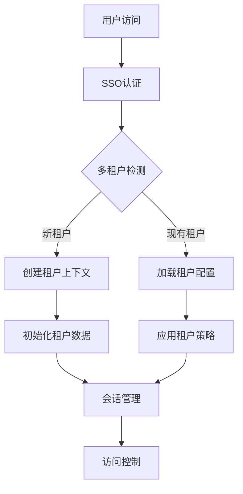

# 企业级智能投标系统架构设计

## 系统概述
基于AutoGen的多租户智能投标系统，满足企业级生产环境要求，包含SSO集成、租户隔离、弹性工作流和现代化UI。

## 技术架构

### 前端层 (Next.js 14)
- **框架**: Next.js 14 + TypeScript + Tailwind CSS
- **认证**: NextAuth.js + SSO集成 (Auth0/Okta/Azure AD)
- **UI组件**: Shadcn UI + 科技感设计系统
- **状态管理**: React Context + SWR
- **实时通信**: WebSocket + Server-Sent Events

### API层 (FastAPI)
- **框架**: FastAPI + Uvicorn
- **认证**: JWT + 租户上下文中间件
- **数据库**: PostgreSQL + SQLAlchemy ORM
- **缓存**: Redis (会话/工作流状态)
- **消息队列**: Celery + Redis (异步任务)

### 智能体层 (AutoGen 0.7.5)
- **核心框架**: AutoGen AgentChat
- **智能体类型**: 招标分析、知识检索、内容生成、合规验证
- **协作模式**: GroupChat + 工作流编排
- **外部集成**: FastGPT RAG API + 行业知识库

### 数据层
- **主数据库**: PostgreSQL (多租户隔离)
- **缓存层**: Redis (会话/状态)
- **文件存储**: 云存储/S3 (文档存储)
- **监控**: Prometheus + Grafana

## 核心功能模块

### 1. 认证与租户管理
---

---

### 2. 弹性工作流引擎
---
```python
class ResilientWorkflow:
    """弹性工作流管理器"""
    
    async def execute_workflow(self, workflow_id: str, tenant_context: TenantContext):
        """执行带检查点的工作流"""
        try:
            # 加载工作流状态
            state = await self.load_checkpoint(workflow_id)
            
            # 执行步骤，自动保存检查点
            for step in workflow_steps:
                await self.execute_step_with_checkpoint(step, state)
                
            # 完成工作流
            await self.complete_workflow(workflow_id)
            
        except Exception as e:
            # 自动恢复机制
            await self.recover_from_failure(workflow_id, e)
```
---

### 3. 智能体协作系统
---
```python
class TenantAwareAgentManager:
    """租户感知的智能体管理器"""
    
    def __init__(self, tenant_id: str):
        self.tenant_id = tenant_id
        self.agents = self._initialize_tenant_agents()
        
    def _initialize_tenant_agents(self):
        """初始化租户特定的智能体配置"""
        return {
            "tender_analysis": TenderAnalysisAgent(
                config=self._get_tenant_config("tender_analysis")
            ),
            "knowledge_retrieval": KnowledgeRetrievalAgent(
                config=self._get_tenant_config("knowledge_retrieval")
            ),
            # ... 其他智能体
        }
```
---

## 部署架构

### 开发环境
- **本地开发**: Docker Compose (PostgreSQL + Redis)
- **前端**: Next.js 开发服务器
- **后端**: FastAPI + 热重载

### 生产环境
- **容器化**: Docker + Kubernetes
- **负载均衡**: Nginx + 健康检查
- **数据库**: PostgreSQL 集群 + 读写分离
- **缓存**: Redis 集群
- **监控**: Prometheus + Alertmanager

## 安全设计

### 数据隔离
- **数据库级**: 租户ID分区 + 行级安全
- **应用级**: 中间件验证 + 上下文注入
- **网络级**: VPC隔离 + 安全组

### 访问控制
- **RBAC**: 基于角色的权限管理
- **ABAC**: 基于属性的访问控制
- **审计**: 完整的操作日志

## 性能优化

### 前端优化
- **代码分割**: 按路由懒加载
- **缓存策略**: SWR + 本地存储
- **图片优化**: WebP格式 + 懒加载

### 后端优化
- **数据库**: 连接池 + 查询优化
- **缓存**: 多级缓存策略
- **异步处理**: Celery任务队列

## 监控与运维

### 应用监控
- **指标收集**: Prometheus指标
- **日志聚合**: ELK Stack
- **追踪**: OpenTelemetry

### 业务监控
- **工作流状态**: 实时仪表盘
- **用户行为**: 分析平台集成
- **错误追踪**: Sentry集成